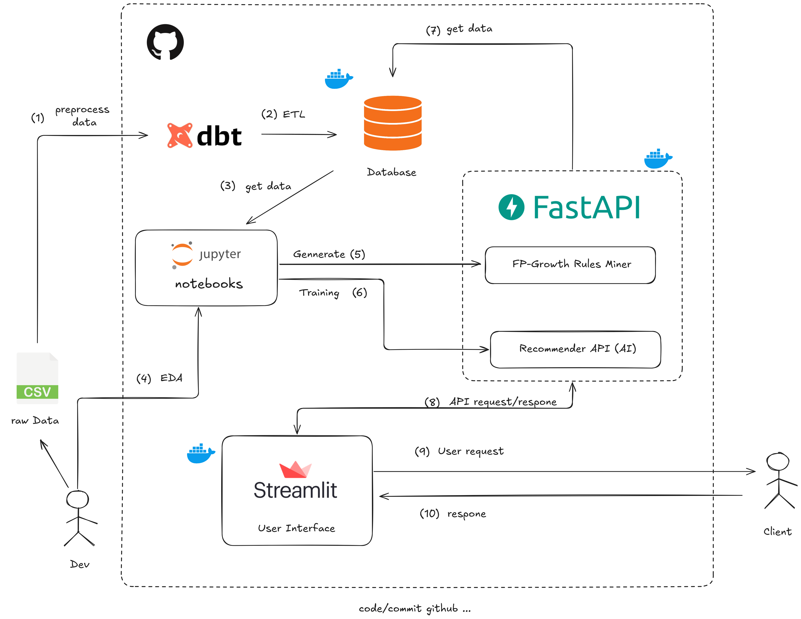

# Market Basket Analysis Demo
## 1. Overview
This project aims to build a recommendation system based on **FP-Growth** and **Neural Collaborative Filtering (NCF)** to solve the **Market Basket Analysis** problem.

FP-Growth is part of Association Rule Mining family and is widely used in recommendation systems due to its ability to handle small datasets, provide interpretable rules, and address cold-start problems—issues common in deep learning models.
### 1.1 Idea
Given an item purchased by a customer, the API will return a list of items that are frequently bought together based on FP-Growth association rules. In addition, we integrate a personalized recommendation model (NCF) trained via deep learning to boost accuracy.
### 1.2 Reference Links
- [FP-Growth Explanation on Medium](https://medium.com/@anilcogalan/fp-growth-algorithm-how-to-analyze-user-behavior-and-outrank-your-competitors-c39af08879db)
- [Use cases of Association Rule Mining - Kaggle](https://www.kaggle.com/code/mohammedderouiche/association-rule-mining-for-mba)
---

## 2. System Architecture


## 3. Repository Structure
```bash
.
├── backend/                # FastAPI backend
│   ├── main.py             # API entry point
│   ├── recommender_fp.py   # FP-Growth logic
│   ├── recommender_dl.py   # NCF recommendation logic
│   ├── logger.py           # Logging configuration
│   └── ...
├── market_basket_analysis/         # dbt project (models, analysis, seeds, tests, ...)
├── ui/                    # Streamlit user interface
├── data/                  # Input datasets (.csv, .db)
├── models/                # Trained models (NCF, FP rules)
├── docker/                # Docker-related files
│   ├── Dockerfile.backend
│   ├── Dockerfile.ui
│   ├── docker-compose.yml
│   ├── entrypoint.sh
│   └── ...
├── notebooks/             # Exploratory notebooks for training
└── requirements.txt       # Python dependencies
```

## 4. Technologies Used
- **Linux**

- **FastAPI** for backend RESTful APIs with logging
- **dbt (Data Build Tool)** for data transformation
- **Docker** and **Docker Compose** for containerization
- **Streamlit** for building the frontend UI
- **Postgres** for local database
- **FP-Growth** algorithm and **NCF** deep learning model


## 5. Installation
### 5.1 Prerequisites
- Docker & Docker-Compose installed
- Python 3.10+ (if running locally without Docker)
### 5.2 Quick Start with Docker
```bash
git clone https://github.com/nhnammldlnlpcvrs/recommendation-systems-rule-base.git

cd recommendation-systems-rule-base/docker

docker compose up --build
```
#### Access:
- Backend API: http://localhost:8000/docs
- Frontend (Streamlit): http://localhost:8501
### 5.3 Run without Docker (Optional)

#### Run Backend API
```bash
pip install -r requirements_dev.txt

cd backend

uvicorn backend.main:app --reload
```
#### Run Frontend
```bash
cd ui

streamlit run streamlit_app.py
```
## 6. Run dbt Project

### 6.1 Initialize dbt
```bash
cd market_basket_analysis

dbt deps
```
This step downloads all dbt packages defined in your ***packages.yml***

### 6.2 Seed data
```bash
dbt seed
```
This will load the CSV files inside the seeds/ folder into your SQLite database.
### 6.3 Run Models
```bash
dbt run
```
This executes all the dbt models (SQL transformations) and creates the final tables inside the database.
### 6.4 Test Models (Optional)
```bash
dbt test
```

### 6.5 Export Models to CSV
```bash
cd export

python export_data.py
```
This script will read the fp_growth_mba.db SQLite file and export the final model tables (e.g., transaction_fpgrowth, user_item_dl) into CSV files inside the **data/** folder.
## 7. API Overview
Base URL: http://localhost:8000

Interactive Docs
- Swagger UI: http://localhost:8000/docs

Endpoints
| Method | Endpoint             | Query Params                              | Description                                                                            |
| ------ | -------------------- | ----------------------------------------- | -------------------------------------------------------------------------------------- |
| GET    | `/recommend/by-item` | `item` (str), `top_k` (int, default=5)    | Recommend items frequently bought together using **FP-Growth**.                        |
| GET    | `/recommend/by-user` | `user_id` (int), `top_k` (int, default=5) | Recommend items based on user behavior using **Neural Collaborative Filtering (NCF)**. |

### Example Requests

Recommend by Item

```cpp
GET /recommend/by-item?item=charlotte+bag+suki+design&top_k=3
```

Response:
```cpp
{
    "item": "charlotte bag suki design",
    "suggestions": [
        {
            "item": "red retrospot charlotte bag",
            "score": 0.5094
        },
        {
            "item": "woodland charlotte bag",
            "score": 0.4137
        },
        {
            "item": "strawberry charlotte bag",
            "score": 0.4
        }
    ]
}
```
Recommend by User
```cpp
GET /recommend/by-user?user_id=17841&top_k=3
```

Response:
```cpp
{
    "user_id": 17841,
    "suggestions": [
        {
            "item": "magic garden felt garland",
            "score": 1.0
        },
        {
            "item": "house shape pencil sharpener",
            "score": 1.0
        },
        {
            "item": "office mug warmer polkadot",
            "score": 1.0
        }
    ]
}
```
### ✅ Status Codes
- 200 OK – Request successful

- 422 Unprocessable Entity – Missing or invalid query parameters